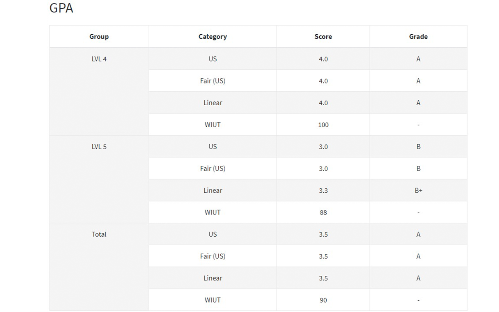

# Markify Intranet

This Chrome extenstion will automatically calculate your total mark and GPA in the WIUT Intranet/SRS.

*Calculated field was added*

## Installation
### Automatic
- Just go to [this link](https://chromewebstore.google.com/detail/markify-intranet/oecblebimehddgocfkanackbenlifkjh?hl=ru)

### Manual
For now only manual installation is available.

1. Download the repo
2. Place the folder where it is convinient for you.
  *Place it somewhere safe, you should not delete it*

3. Open Chrome and go to extensions `chrome://extensions/`
4. Turn on developer mode
5. Click on "Upload unpacked extension" and select the folder you've downloaded in step 1.
6. Enjoy.

*More comprehensive guide: [Click](https://developer.chrome.com/docs/extensions/get-started/tutorial/hello-world?hl=ru#load-unpacked)*

## How to use?
After installation, you are good to go. Nothing extra is needed.
Whenever you visit a page of intranet for provisional marks, Markify will append
calculated value to the header of that page *(shown in photo above)*

## Story
Interestingly, intranet already has this feature.
However, for some reason it is not used in the student interface.